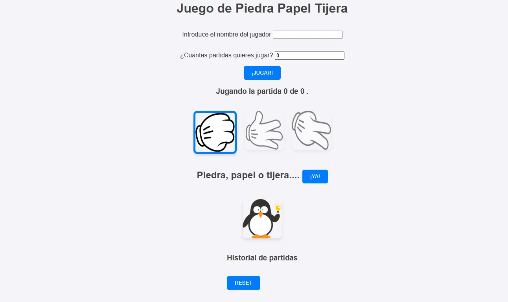

## 🪨 📄 ✂️ Piedra, Papel o Tijeras

https://piedra-papel-tijeras-ten.vercel.app/

🚀 Tecnologías

HTML5 (estructura semántica)

CSS3 (diseño responsive + animaciones)

JavaScript (lógica del juego)

🔥 Características
Interfaz intuitiva y amigable.

Sistema de puntuación en tiempo real.

Efectos visuales al jugar.

📦 Instalación
Clona el repositorio:

git clone https://github.com/alvaromt6/Piedra-Papel-Tijeras.git  

Abre el archivo index.html en tu navegador.

🌟 ¿Cómo jugar?
Elige entre piedra, papel o tijeras.

La computadora seleccionará una opción aleatoria.

🤝 Contribuir
¿Quieres mejorar el juego? ¡Abre un PR (Pull Request)**!
